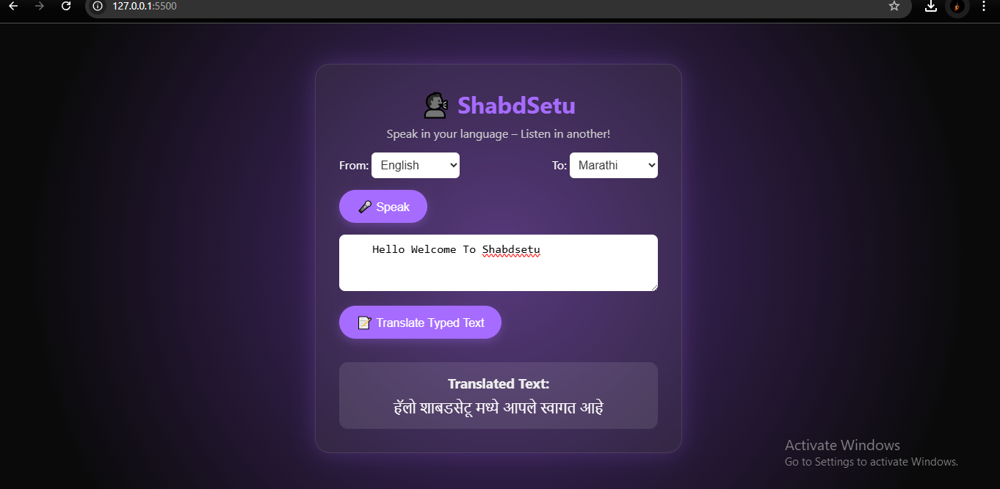

Project: ShabdSetu – Voice Translator Web App

Built a real-time voice and text translator using SpeechRecognition, Google Translate, and Web Speech APIs

Supports Hindi, Marathi, Gujarati, Malayalam, English

Dual-mode input: 🎤 speech + ✍️ typed text, speaks translated output

Hosted on Render for public use

Tech: HTML, CSS, JS, REST APIs, Web Speech API
